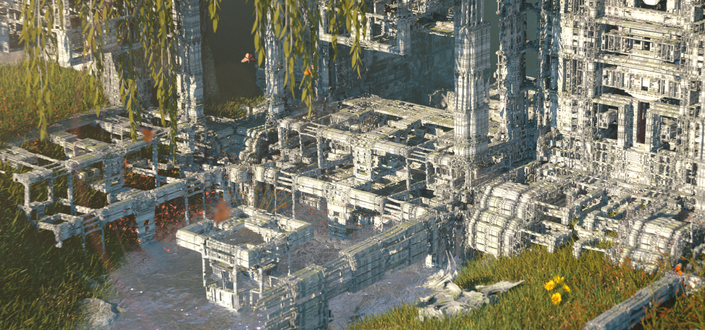

## MACHINA INFINTIUM
### Diseño Procedural con Fractales

Machina Infintum es una empresa que realiza animaciones procedurales con fractales usando Unreal Engine y sus blueprints para tener plantillas personalizables de los mismsmos.
Con la posibilidad de modificar ciertos parámetros en tiempo real, se asegurna resultados distintos y controlados cada vez, haciendo que las pposibilidades creativas sean muy amplias. 
Este tipo de diseños de patrones 3D cambiantes son muy útiles para poder crear ambientes que se van contruyendo, cambiando y deformando conforme avanza una secuencia, coneptos muy innovadores para un video.

Machina Infintum ha trabajado para varios artistas, Mastodon, Palaces, DJ Bhediya y, lo que me llevó a conocer su trabajo, Metallica. 
El trabajo con Metallica consisitió en un video musical para la premier en cines de su canción "Crown Of Barbed Wire", y es remarcable como, pese a la generación de detalles "aleatorios" los artistas son capaces de construir formas concretas a partir de nebulosas de fractales. 

Este video se siente más a tono con la canción que el video oficial que acabaron sacando, donde la animación pierde por completo la fluidez, todo es visualmente menos atractivo, y no genera el gancho ni el ambiente oscuro que el video de Machina Infinitum.

Otros trabajos consisten en renders estáticos para conseguir imágenes de paisajes oníricos, experiencias más interactivas con domos y pequeños cortometrajes.

Para indagar más sobre Machina Infinitum, dejo el link a su página, donde hablan más a profundidad de los algoritmos de los fractales, tienen tutoriales sobre como usar plantillas y muestran más trabajos: 
https://www.machina-infinitum.com/
