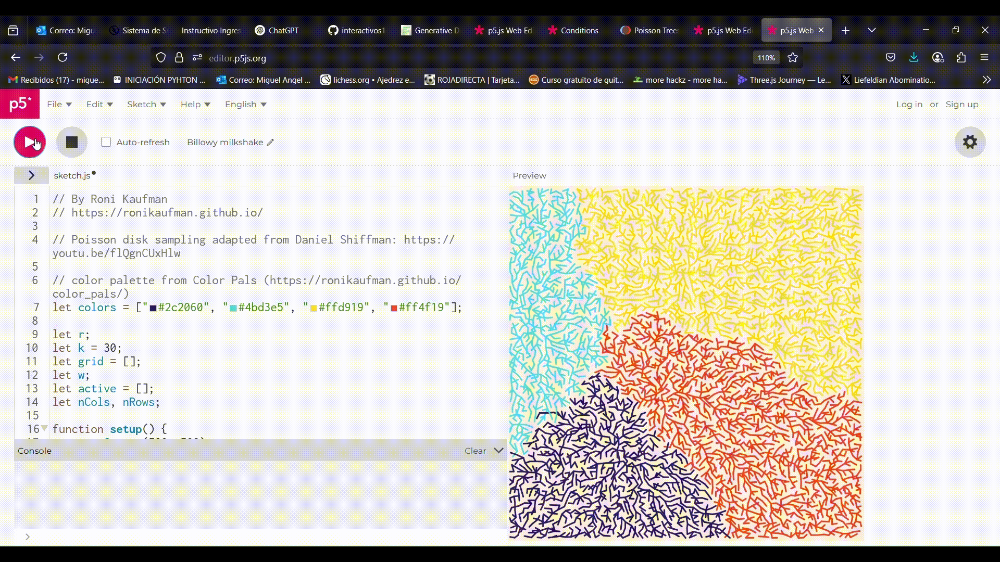

### Ejemplo 1:
#### ¿Qué me llamó la atención?


#### Mis modificaciones al código

```py
```

#### ¿Qué cambios hice?

### Ejemplo 2:
#### ¿Qué me llamó la atención?


#### Mis modificaciones al código

```py
```

#### ¿Qué cambios hice?

### Ejemplo 3:
#### ¿Qué me llamó la atención?



#### Mis modificaciones al código

```py
```

#### ¿Qué cambios hice?

