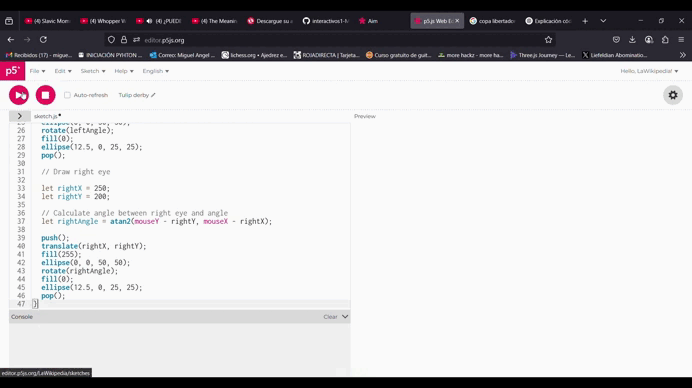

### Ejemplo 1:
#### ¿Qué me llamó la atención?

Me encanta el rastro tan lindo que deja el círculo. Leyendo el código, entendí que en la función Draw, por cada frame, se dibuja un círculo, y si la posición de este se actualiza cada frame, se va creando una estela. Hay vectores de posición x y y que se encargan de ubicar al círculo en el espacio y vectores de velocidad que se encargan de cambiar su posición respecto al tiempo. Si uno hace click con el mouse, su la bola acelera tanto en x como en y. Cambia de color pues cada que se presiona el mouse, el hue, o valor del color, aumenta 1. Este tiene un máximo de 360 y, cuando llega a ese máximo, se resetea a 1. Aquí el enclace: https://editor.p5js.org/LaWikipedia/full/xaxriTVf_

#### Mis modificaciones al código

```py
if (key === 'w') {
    // Add speed to circle's position to make it move
    circlePositionY = circlePositionY - circleSpeedY;
    print ("w was pressed");
    // Increase hue by 1
    circleHue = circleHue + 1;
  }
  if (key === 's') {
    // Add speed to circle's position to make it move
    circlePositionY = circlePositionY + circleSpeedY;
    print ("s was pressed");
    // Increase hue by 1
    circleHue = circleHue + 1;
  }
  if (key === 'a') {
    // Add speed to circle's position to make it move
    circlePositionX = circlePositionX - circleSpeedX;
    print ("a was pressed");
    // Increase hue by 1
    circleHue = circleHue + 1;
  }
  if (key === 'd') {
    // Add speed to circle's position to make it move
    circlePositionX = circlePositionX + circleSpeedX;
    print ("d was pressed");
    // Increase hue by 1
    circleHue = circleHue + 1;
  }
```

#### ¿Qué cambios hice?

No me gustaban los bordes grises, así que los removí, y cambié la forma en la que la que el círculo es controlado. Ahora con movimientos horizontales y verticales, en vez diagonales, con las teclas w, a, s, y d. Aquí el enlace: https://editor.p5js.org/LaWikipedia/full/bx058uKE-


### Ejemplo 2:
#### ¿Qué me llamó la atención?

A medida que se mueve el mouse ocurren dos cosas y me encanta el efecto visual generado: si mueves el mouse en el eje X, va a aumentar el radio del círculo que se está generando con las líneas rectas (todo visible en le gif de más abajo) y la cantidad de líneas rectas está dada por el movimiento en el eje Y, con una función map, que agarra un valor que está entre un mínimo y un máximo, y devuleve uno proporcional a ese valor entre dos nuevos mínimos y máximos. En este código, la cantidad de líneas se llama circleResolution y su valor esta dado por la función map. El enlace acá: https://editor.p5js.org/LaWikipedia/full/73XrSeEO1


#### Mis modificaciones al código

```py
 for (var i = 0; i <= circleResolution; i++) {
    var hue = map(i, 0, circleResolution, 0, 360); // Va de 0 a 360 según la línea
    stroke(hue, 100, 100); // Saturación y brillo al máximo

    var x = cos(angle * i) * radius;
    var y = sin(angle * i) * radius;
    line(0, 0, x, y);
  }
```

#### ¿Qué cambios hice?

Cada línea ahora va a ser coloreada con un estandar Hue, Saturation, Value, y va a cambiar únicamente el valor del Hue por ccada línea. Va a funcionar como una proporción en el ciclo for: El ciclo for tiene un valor que oscila entre 0 y circleResolution, que es i, y queiro que cada línea se coloree en el orden correcto del espectro de color, haciendo que la última siempre sea 360 (el valor máximo del Hue) y la primera siempre sea 0 (el mínimo del Hue). Así que tengo dos valores qye van a oscilar entre dos topes y quiero que sean proporcionales entre si. Para esto, me sirve la función map. Digamos que circleResolution es 20 y estoy con i = 5. Eso significa que estoy a un cuarto del camino entre 0 y 20. Así mismo debería estar el Hue, a un cuarto de camino entre 0 y 360, osea que el Hue en la recta 5 sería de 9, y así con todas. El enlace: https://editor.p5js.org/LaWikipedia/full/NFdltnmTQ

.gif)

### Ejemplo 3:
#### ¿Qué me llamó la atención?



#### Mis modificaciones al código

```py
```

#### ¿Qué cambios hice?

