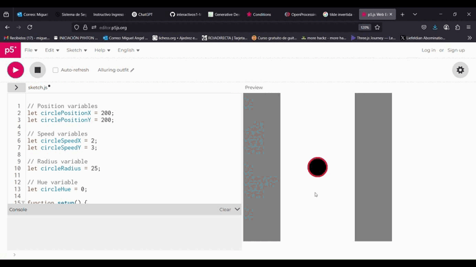
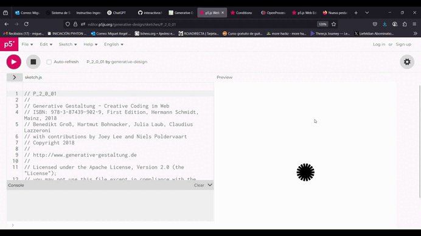

### Ejemplo 1:
#### ¿Qué me llamó la atención?

Me encanta el rastro tan lindo que deja el círculo. Leyendo el código, entendí que en la función Draw, por cada frame, se dibuja un círculo, y si la posición de este se actualiza cada frame, se va creando una estela. Hay vectores de posición x y y que se encargan de ubicar al círculo en el espacio y vectores de velocidad que se encargan de cambiar su posición respecto al tiempo. Si uno hace click con el mouse, su la bola acelera tanto en x como en y. Cambia de color pues cada que se presiona el mouse, el hue, o valor del color, aumenta 1. Este tiene un máximo de 360 y, cuando llega a ese máximo, se resetea a 1. Aquí el enclace: https://editor.p5js.org/LaWikipedia/full/xaxriTVf_



#### Mis modificaciones al código

```py
if (key === 'w') {
    // Add speed to circle's position to make it move
    circlePositionY = circlePositionY - circleSpeedY;
    print ("w was pressed");
    // Increase hue by 1
    circleHue = circleHue + 1;
  }
  if (key === 's') {
    // Add speed to circle's position to make it move
    circlePositionY = circlePositionY + circleSpeedY;
    print ("s was pressed");
    // Increase hue by 1
    circleHue = circleHue + 1;
  }
  if (key === 'a') {
    // Add speed to circle's position to make it move
    circlePositionX = circlePositionX - circleSpeedX;
    print ("a was pressed");
    // Increase hue by 1
    circleHue = circleHue + 1;
  }
  if (key === 'd') {
    // Add speed to circle's position to make it move
    circlePositionX = circlePositionX + circleSpeedX;
    print ("d was pressed");
    // Increase hue by 1
    circleHue = circleHue + 1;
  }
```

#### ¿Qué cambios hice?

No me gustaban los bordes grises, así que los removí, y cambié la forma en la que la que el círculo es controlado. Ahora con movimientos horizontales y verticales, en vez diagonales, con las teclas w, a, s, y d. Aquí el enlace: https://editor.p5js.org/LaWikipedia/full/bx058uKE-


### Ejemplo 2:
#### ¿Qué me llamó la atención?



#### Mis modificaciones al código

```py
```

#### ¿Qué cambios hice?

### Ejemplo 3:
#### ¿Qué me llamó la atención?


#### Mis modificaciones al código

```py
```

#### ¿Qué cambios hice?

