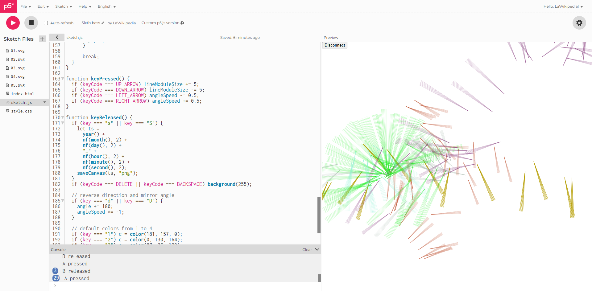
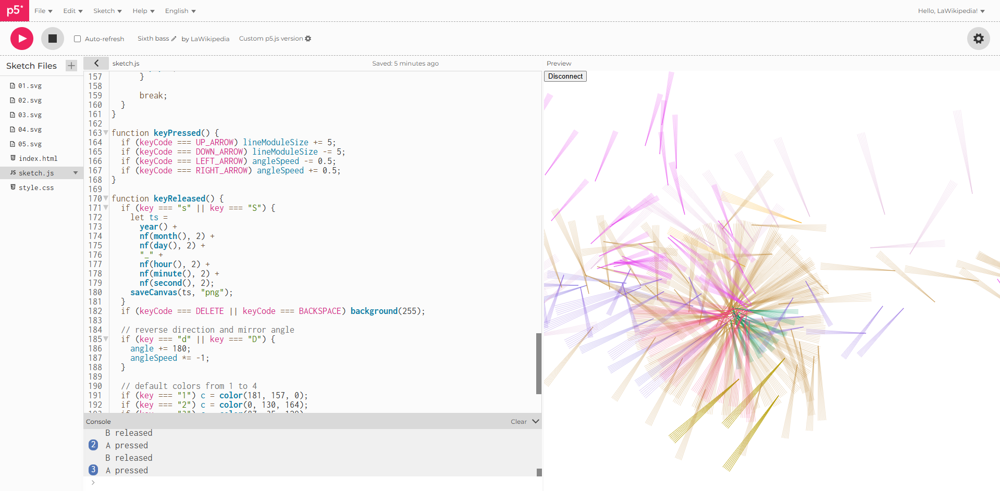

### Respuestas

#### ¿Cómo se comunican el sketch y el microbit?

Se comunican a través del puerto serial. Se establecen variables que faciliten la conección en p5.js, un puerto, un botón para establecer la conexión y una variable que nos diga si el microbit está conectado o no: 

```js
let port;
let connectBtn;
let microBitConnected = false;
```
Usando las funciones createSerial() se establece el puerto y se crea un botón para que el usuario pueda abrirlo. Si se le da click y el puerto no está abierto, se abre con por.opened(), si se vuelve a dar click y estaba abierto, se cierra con port.close() (todo esto está escrito en la función connectBtnClick())
```js
function setup() {
  createCanvas(windowWidth, windowHeight);
  background(255);

  port = createSerial();
  connectBtn = createButton("Connect to micro:bit");
  connectBtn.position(0, 0);
  connectBtn.mousePressed(connectBtnClick);
}

function connectBtnClick() {
  if (!port.opened()) {
    port.open("MicroPython", 115200);
  } else {
    port.close();
  }
```
#### ¿Cómo es el paquete de datos enviado por el microbit?

El formato de datos es ASCII y plantea enviar entre corchetes cuatro datos del microbit separados con comas y con un salto de línea, para que, siguiendo este protocolo, al llegar al sketch se pueda hacer una diferenciación de los datos con las comas y se haga tambien una diferenciación de los paquetes de datos gracias al salto de línea. 

```py
data = "{},{},{},{}\n".format(xValue, yValue, aState,bState)
```

#### ¿Qué parte del sketch convierte datos del microbit a coordenadas?

Hay dos partes importantes para que esto se logre: Lo primero es recibir los datos desde el serial y hacer que el dato 0,0 coincida en el centro del lienzo (por eso
se le suma windowWidth/2 y windowHeight/2).
```js
 if (values.length == 4) {
          microBitX = int(values[0]) + windowWidth / 2;
          microBitY = int(values[1]) + windowHeight / 2;
 ```

Ahora que tenemos los datos pulidos, podemos hacer que las coordenadas x y y que usa la función draw para dibujar, coincidan con los valores microBitX y microBitY, 
para que los datos que llegan de microbit, ahora sí, controlen la aplicación. 
```js
  if (microBitAState === true) {
        let x = microBitX;
        let y = microBitY;
```
#### ¿Cómo se generan los eventos A pressed y B released?

Primero se tienen que recibir los datos de microbit, que se van a guardar en las variables microbBitAState y microBitBState, para luego ser enviadas a la función updateButtonStates.
```js
   microBitAState = values[2].toLowerCase() === "true";
   microBitBState = values[3].toLowerCase() === "true";
   updateButtonStates(microBitAState, microBitBState);
```
Dicha función recbie los datos recién guardados desde el microbit y con ellos corrobora unas cosas: hay unas variables globales llamadas prevmicroBitAState y prevmicroBitBState, que son los estados previos de los botones y se inician en false. Si ahora el botón A está siendo presionado y previamente no lo estaba siendo, se ejecuta alguna acción, pues eso significa que, en este momento, está siendo oprimido. Con la B aplica un caso similar: Si no está siendo oprimido pero hace un momento sí, significa que se soltó el botón y pasa otra acción. Por último, y para que no se quede en un mismo estado de forma infinita, hay que actualizar los prevmicroBitAState y prevmicroBitBState al final de dichas acciones para el siguiente frame, haciendo la operación prevmicroBitAState = newAState y prevmicroBitBState = newBState.
```js
function updateButtonStates(newAState, newBState) {
  // Generar eventos de keypressed
  if (newAState === true && prevmicroBitAState === false) {
    // create a new random color and line length
    lineModuleSize = random(50, 160);
    // remember click position
    clickPosX = microBitX;
    clickPosY = microBitY;
    print("A pressed");
  }
  // Generar eventos de key released
  if (newBState === false && prevmicroBitBState === true) {
    c = color(random(255), random(255), random(255), random(80, 100));
    print("B released");
  }

  prevmicroBitAState = newAState;
  prevmicroBitBState = newBState;
}
```
### Dibujos Realizados



